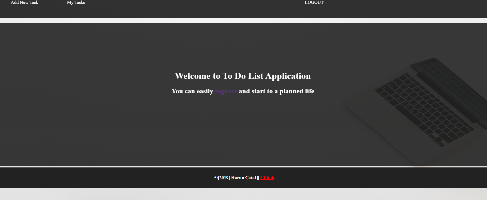
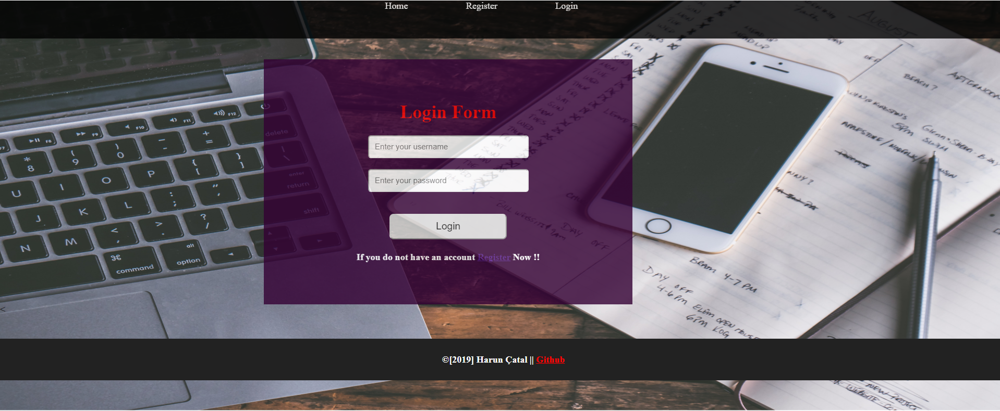
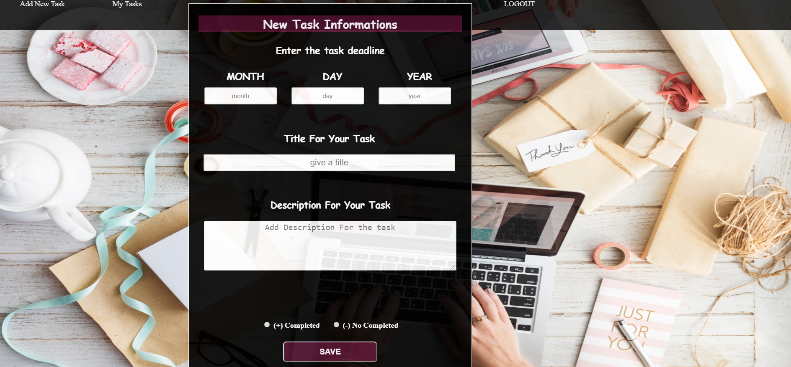
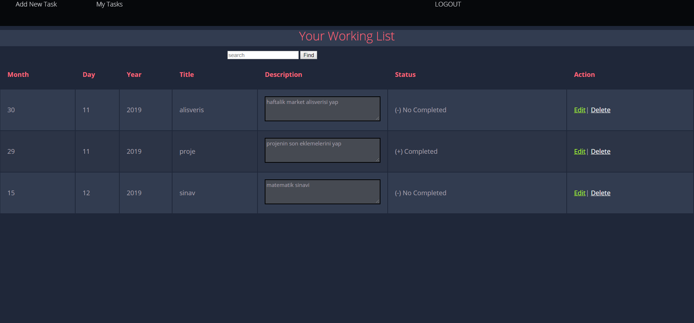

-Açıklama:

Spring,HTML ve CSS kullanılarak yazılmış bir todo list uygulamasıdır. Üyelik paneli, todolist oluşturma, düzenleme, sıralama gibi fonksiyonlara sahiptir.

-Uygulamanın eksikleri
Verilen sürenin büyük bir kısmında todolistler oluşturup bu todolistlerin içine task'lar yerleştirmeye çalıştım. Ama spring e yeni başladığım için bu sorunun üstesinden gelemedim. Task ekleme kısmında todolistin id sini kaybediyordum ve bir türlü elde etmeyi başaramadım. Onu başarsaydım devamını da aynı şekilde getirecektim. Ben de yapamamaktansa tek bir todolist üzerinden sunmayı düşündüm. Onun dışında diğer eksiği de görevler arasında dependency oluşturamamam.Normalde unit test tecrübem var fakat bunlara yazdığım testleri uygulama ile aynı anda çalıştırmayı başaramadım. Server üzerinde nasıl testleri çalıştırabileceğimi bilemedim. Geri kalan kısmını yapmaya çalıştım.
Teşekkür ederim..

-Çalıştırma:

Uygulama Apache Tomcat v9.0 Server' ı üzerinde çalışır. Database olarak da h2 database kullanılmaktadır. Gereksinimler klasöründe ikisinin de jar dosyasını ekleyeceğim. Apache server'ını kurduktan sonra Servers kısmında Add and Remove kısmından projeyi eklemeyi unutmayınız. 

-h2 database ayarları: 

Veri tabanı sürücü sınıfı: org.h2.Driver
JDBC URL : jdbc:h2:tcp://localhost/~/todo
Kullanıcı adı: sa
Şifre: 

-Database için tablo ekleme kodları
Query For User table

CREATE TABLE User(
  userid INT AUTO_INCREMENT PRIMARY KEY,
  name VARCHAR(255) NOT NULL,
  surname VARCHAR(255) NOT NULL,
  password VARCHAR(255) NOT NULL,
  loginName VARCHAR(255) NOT NULL,

);

Query for TodoList table
CREATE TABLE TodoList(
  todoListId INT AUTO_INCREMENT PRIMARY KEY,
  userId INT,
  month VARCHAR(255) NOT NULL,
  day VARCHAR(255) NOT NULL,
  year VARCHAR(255) NOT NULL,
  title VARCHAR(255) NOT NULL,
  description VARCHAR(255) NOT NULL,
  status VARCHAR(255) NOT NULL,

FOREIGN KEY (userId) REFERENCES User(userId)
);

-Ekran görüntüleri

